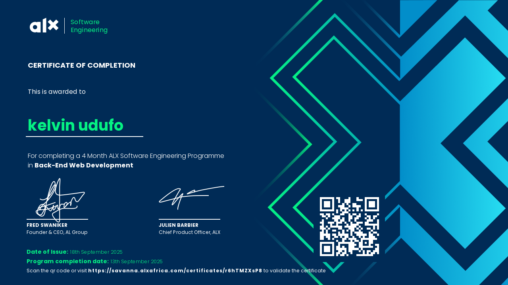
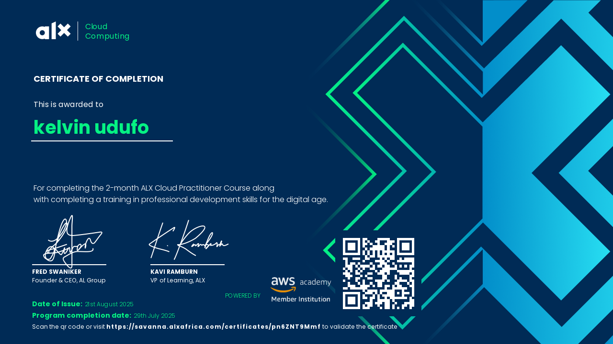
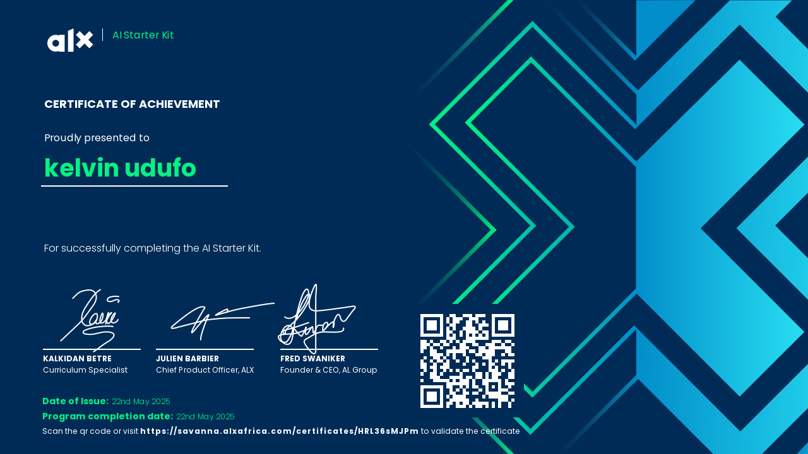
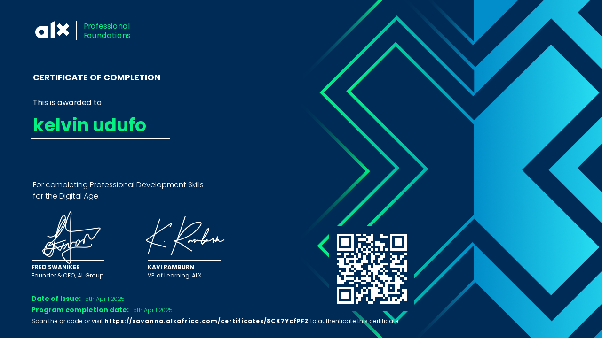

<h1 align="center">👋 Hey!, I'm Kelvin Udufo</h1>

<p align="center">
  <strong>Backend Engineer | ALX Software Engineering Program</strong>
</p>

<p align="center">
  
</p>

<p align="center">
  <a href="mailto:kelvin.udufo@example.com"></a>
  <a href="https://www.linkedin.com/in/kelvin-udufo"></a>
  <a href="https://twitter.com/Elkel_"></a>
  <a href="https://kelvyn2012.github.io/My-Site/"></a>
</p>

---

## 💡 About Me

Backend engineer from **Lagos, Nigeria** 🇳🇬, currently leveling up through the **ALX Software Engineering Program**. I'm on a mission to build backend systems that are not just functional, but elegant and scalable.

```python
class KelvinUdufo:
    def __init__(self):
        self.location = "Lagos, Nigeria"
        self.current_focus = ["Backend Development", "System Design", "DevOps"]
        self.learning = ["Kubernetes", "Microservices", "Cloud Infrastructure"]
        self.interests = ["AI/ML", "Problem Solving", "Open Source"]
    
    def say_hi(self):
        print("Let's build something amazing together!")
```

**What drives me:** I believe technology should solve real problems. Every line of code I write is a step toward creating solutions that make a difference.

---

## 🛠️ Tech Arsenal

**Languages**  


**Backend & Databases**  


**DevOps & Tools**  


**Frontend (when needed)**  


---

## 🎓 Certifications & Achievements

<div align="center">

### 📜 Professional Certifications

<table>
  <tr>
    <td align="center" width="50%">
      <a href="LINK_TO_CERT_1">
        <br/>
        <b>ALX Software Engineering Certificate</b>
      </a><br/>
      <sub>Issued: Dec 2025</sub>
    </td>
    <td align="center" width="50%">
      <a href="LINK_TO_CERT_2">
        <br/>
        <b>AWS Cloud Practitioner</b>
      </a><br/>
      <sub>Issued: August 2025</sub>
    </td>
  </tr>
  <tr>
    <td align="center" width="50%">
      <a href="LINK_TO_CERT_3">
        <br/>
        <b>Alx AI Starter Kit</b>
      </a><br/>
      <sub>Issued: May 2025</sub>
    </td>
    <td align="center" width="50%">
      <a href="LINK_TO_CERT_4">
        <br/>
        <b>Professional Foundations</b>
      </a><br/>
      <sub>Issued: April 2025</sub>
    </td>
  </tr>
</table>

### 🏆 Badges & Achievements

[](VERIFICATION_LINK)
[](VERIFICATION_LINK)
[](VERIFICATION_LINK)
[](VERIFICATION_LINK)

**View all certifications →** [Credential Portfolio](https://github.com/Kelvyn2012/certifications)

</div>

---

## 🚀 Featured Projects

### 🏠 [Airbnb Clone](https://github.com/Kelvyn2012/AirBnB_clone)
**A full-stack Airbnb replica built from the ground up**

Building this comprehensive clone has been my deep dive into real-world software architecture. From custom ORMs to RESTful APIs, this project showcases scalable backend design principles.

**Key Features:**
- Custom command interpreter for data management
- Object-Relational Mapping (ORM) system
- RESTful API with full CRUD operations
- File and database storage engines
- Comprehensive unit testing suite

**Tech:** `Python` `Flask` `SQLAlchemy` `MySQL` `HTML/CSS` `JavaScript`

---

### 🐚 [Simple Shell](https://github.com/Kelvyn2012/simple_shell)
**UNIX command-line interpreter written in C**

A fully functional shell that demonstrates low-level system programming and understanding of OS processes.

**Tech:** `C` `Linux System Calls` `Process Management`

---

### 🌐 [RESTful API Projects](https://github.com/Kelvyn2012?tab=repositories)
**Various API implementations showcasing backend mastery**

Developed multiple REST APIs with authentication, data validation, and comprehensive documentation.

**Tech:** `Flask` `Node.js/Express` `JWT` `Swagger/OpenAPI`

---

## 📊 GitHub Analytics

<p align="center">
  
  
</p>

<p align="center">
  
</p>

<p align="center">
  
</p>

---

## 🎯 Current Focus

```javascript
const currentGoals = {
    learning: [
        "Advanced System Design Patterns",
        "Kubernetes & Container Orchestration",
        "Microservices Architecture",
        "Cloud-Native Development"
    ],
    building: [
        "Scaling the Airbnb Clone to production",
        "Contributing to open-source projects",
        "Building a developer portfolio of RESTful services"
    ],
    goal: "To architect and build backend systems that scale effortlessly and solve real problems"
};
```

---

## 📫 Let's Build Together

I'm always open to collaborating on interesting projects, discussing tech, or just connecting with fellow developers.

**Reach out if you want to:**
- Collaborate on open-source projects
- Discuss backend architecture and best practices
- Talk about opportunities in tech
- Simply connect and share ideas

<p align="center">
  <a href="mailto:kelvin.udufo@example.com">
    
  </a>
</p>

---

<p align="center">
  
</p>

<p align="center">
  <i>"The best way to predict the future is to implement it." — David Heinemeier Hansson</i>
</p>

<p align="center">⭐️ From <a href="https://github.com/Kelvyn2012">Kelvyn2012</a> with 💻 and ☕</p>
